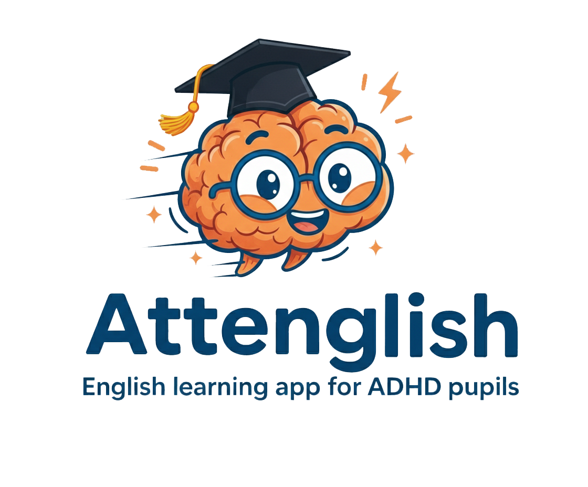

# Attenglish 📚💡
**AI-Powered English Learning App for ADHD Students**

Attenglish is a mobile-first application designed to support English language acquisition for students with ADHD. Built with accessibility, personalization, and gamification in mind, Attenglish empowers both learners and educators with tools that address attention challenges and cognitive variability.
Capstone project was developed by Kfir Amoyal & Omri Heit and advised by Dr. Nataly Levi of Braude College of Engineering.

---

## 🚀 Features

### 🎓 For Students
- **Multimodal Learning**: Interactive lessons using text, audio, images, and mini-games
- **Spaced Repetition Practice**: Reinforces vocabulary and grammar through spaced reviews
- **Gamified Micro-Lessons**: Short, focused tasks with embedded movement breaks
- **AI Visual Prompts**: Learners describe AI-generated images to practice expression

### 👩‍🏫 For Teachers
- **Custom Exercise Uploads**: Convert PDFs into quizzes with AI assistance
- **Student Customization Controls**: Enable or restrict spacing intervals, timer settings, and support flags
- **Dashboards & Alerts**: Real-time alerts for struggling students or repeated errors

### 👨‍👩‍👧 For Parents
- **Engagement Loop**: Notifications after consistent usage or special achievements
- **Privacy-First**: Logs student progress without revealing contact information

---

## 🏗️ System Architecture

- **Frontend**: React Native (or Flutter) for cross-platform mobile support
- **Backend**: Node.js with Express, integrated with Firebase Auth and Firestore
- **AI Services**: OpenAI API for quiz generation and image prompts
- **Storage**: Cloud storage for media, student data, and spaced repetition metadata

---

## 📱 UI/UX Highlights

- ADHD-friendly design: Clear visuals, minimal distractions, adjustable fonts & colors
- Bilingual support: Hebrew-English interface toggle
- Progress tracking and rewards system for motivation

---

## 📋 Functional Requirements (FR)

- Multimodal lesson presentation
- Two-lesson per topic flow: Introduction & Practice
- AI-enhanced image prompts for expression
- Teacher-defined or AI-suggested spaced repetition
- Adaptive content based on performance flags

## ⚙️ Non-Functional Requirements (NFR)

- Fast load time (<2 seconds)
- Full accessibility (WCAG-compliant)
- Secure login with Ministry-issued credentials only
- Long-term data retention and Ministry interoperability

---


## 💾 Installation

```bash
# 1. Clone the repository
git clone https://github.com/your-org/attenglish.git
cd attenglish

# 2. Install Flutter dependencies
flutter pub get

# 3. Set up environment variables
cp .env.example .env
# Edit .env and add your ANTHROPIC_API_KEY

# 4. Install Cloud Functions dependencies
cd functions
npm install
cd ..

# 5. Run on web (Chrome)
flutter run -d chrome

# 6. Run on Android
flutter run -d <device-id>

